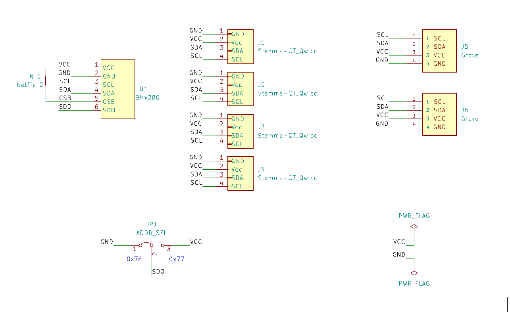
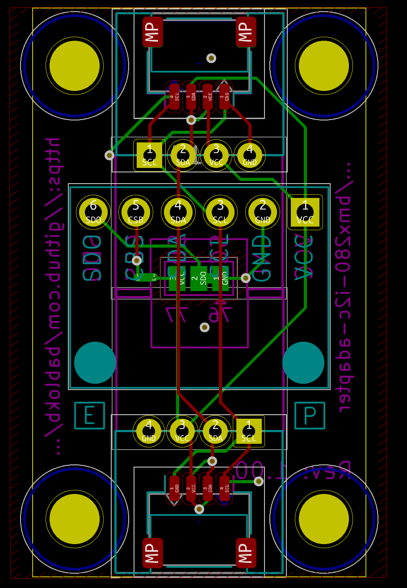
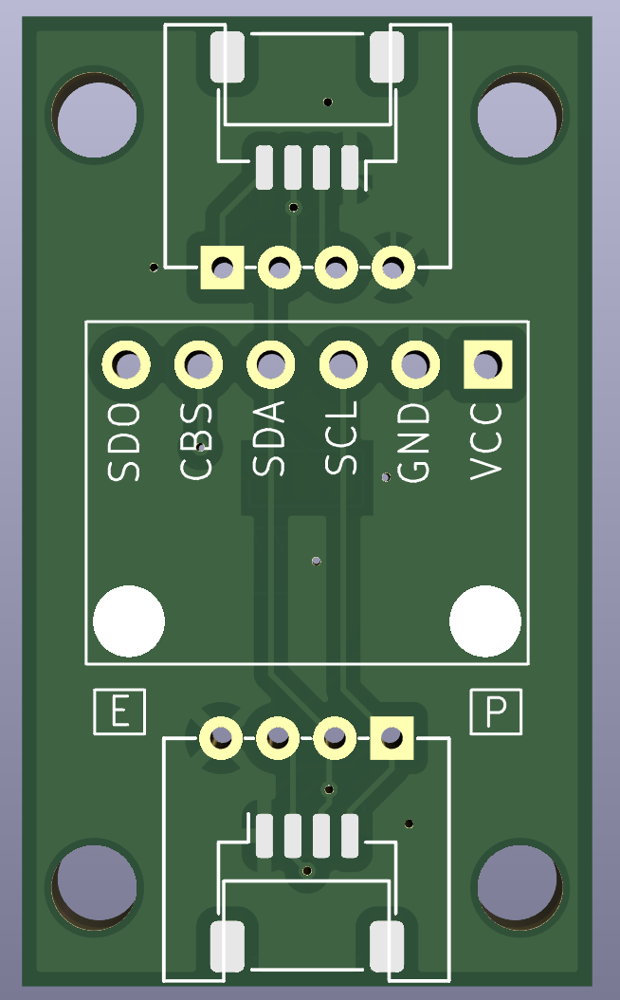
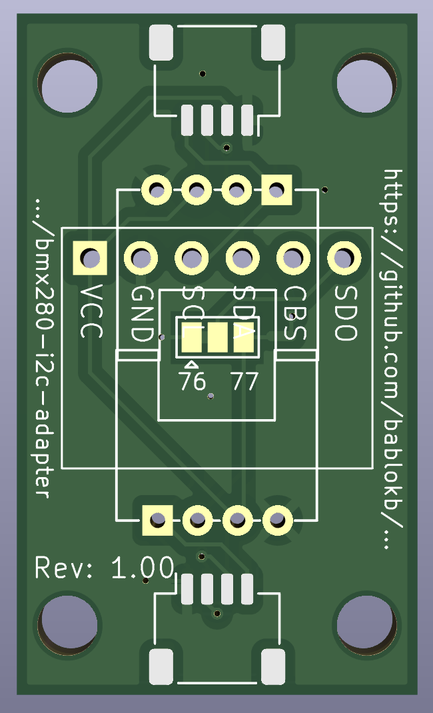

An Adapter PCB for BME280/BMP280 Breakouts Supporting Stemma/Qt and Grove
=========================================================================

Here are the KiCAD (v7) design-files for a small adapter PCB adding
Stemma/Qt and/or Grove I2C-connectors to a BME280/BMP280 breakout. These
breakouts are omnipresent under names like GY-BME280/GY-BMP280. Be
careful, both breakouts look identical and some sellers cheat you: they
send the cheaper BMP280-variant instead of the BME280-variant.

The breakout suports two Stemma/Qt on top and bottom. On the top
side, you can also add two horizontal Grove-connectors. For the
bottom side, only vertical Grove-connectors will work.

The directory `3D` contains design-files for an enclosure in OpenSCAD format.
You also need the [BOSL2-Library](https://github.com/BelfrySCAD/BOSL2).

Schematic
---------

Layout
------

3D-Views
--------

License
-------

[![CC BY-SA 4.0][cc-by-sa-shield]][cc-by-sa]

This work is licensed under a
[Creative Commons Attribution-ShareAlike 4.0 International
License][cc-by-sa].

[![CC BY-SA 4.0][cc-by-sa-image]][cc-by-sa]

[cc-by-sa]: http://creativecommons.org/licenses/by-sa/4.0/
[cc-by-sa-image]: https://licensebuttons.net/l/by-sa/4.0/88x31.png
[cc-by-sa-shield]:
https://img.shields.io/badge/License-CC%20BY--SA%204.0-lightgrey.svg
